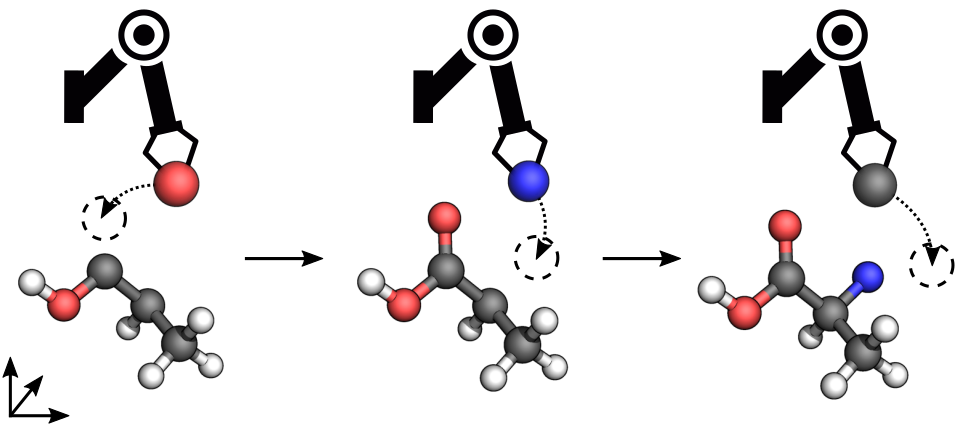

# MolGym: Reinforcement Learning for 3D Molecular Design

This repository allows to train reinforcement learning policies for designing molecules directly in Cartesian coordinates. The agent builds molecules by repeatedly taking atoms from a given _bag_ and placing them onto a 3D _canvas_. 



Check out our [blog post](https://mlg-blog.com/2021/04/30/reinforcement-learning-for-3d-molecular-design.html) for a gentle introduction. For more details, see our papers:

**Reinforcement Learning for Molecular Design Guided by Quantum Mechanics**<br>
Gregor N. C. Simm*, Robert Pinsler* and José Miguel Hernández-Lobato<br>
*Proceedings of the 37th International Conference on Machine Learning*, Vienna, Austria, PMLR 108, 2020.<br>
http://proceedings.mlr.press/v119/simm20b.html

**Symmetry-Aware Actor-Critic for 3D Molecular Design**<br>
Gregor N. C. Simm, Robert Pinsler, Gábor Csányi and José Miguel Hernández-Lobato<br>
*International Conference on Learning Representations*, 2021.<br>
https://openreview.net/forum?id=jEYKjPE1xYN

## Setup

Dependencies:
* Python >= 3.7
* [ase](https://wiki.fysik.dtu.dk/ase/)
* [cormorant](https://github.com/risilab/cormorant)
* [gym](https://www.gymlibrary.ml/)
* [matplotlib](https://matplotlib.org/)
* [pandas](https://pandas.pydata.org/)
* [quadpy](https://github.com/sigma-py/quadpy)
* [schnetpack](https://schnetpack.readthedocs.io)
* [sparrow](https://github.com/qcscine/sparrow) >= 2.0.1
* torch >= 1.5.1
* [torch-scatter](https://github.com/rusty1s/pytorch_scatter) >= 2.0.5

Install required packages and library itself:
```
pip install -r requirements.txt
pip install -e .
```

**Note:** Make sure that the CUDA versions associated with `torch` and `torch-scatter` match. Check the [documentation](https://github.com/rusty1s/pytorch_scatter) if you run into any errors when installing `torch-scatter`.

### Sparrow Setup

Sparrow can be installed using the *conda* package manager and is available on the *conda-forge* channel.
To install the *conda* package manager we recommend the [miniforge](https://github.com/conda-forge/miniforge/releases) installer.
If the *conda-forge* channel is not yet enabled, add it to your channels with

```
conda config --add channels conda-forge
conda config --set channel_priority strict
```

Once the `conda-forge` channel has been enabled, `scine-sparrow-python` can be installed with `conda`:

```
conda install scine-sparrow-python
```


## Usage

You can use this code to train and evaluate reinforcement learning agents for 3D molecular design. We currently support running experiments given a specific bag (single-bag), a stochastic bag, or multiple bags (multi-bag).

### Training
To perform the single-bag experiment with SF6, run
```shell
python3 scripts/run.py \
    --name=SF6 \
    --symbols=X,F,S \
    --formulas=SF6 \
    --min_mean_distance=1.10 \
    --max_mean_distance=2.10 \
    --bag_scale=5 \
    --beta=-10 \
    --model=covariant \
    --canvas_size=7 \
    --num_envs=10 \
    --num_steps=15000 \
    --num_steps_per_iter=140 \
    --mini_batch_size=140 \
    --save_rollouts=eval \
    --device=cuda \
    --seed=1
```
Hyper-parameters for the other experiments can be found in the papers.

### Evaluation

To generate learning curves, run the following command:
```shell
python3 scripts/plot.py --dir=results
```
Running this script will automatically generate a figure of the learning curve.

To write out the generated structures, run the following command:
```shell
python3 scripts/structures.py --dir=data --symbols=X,F,S
```
You can visualize the structures in the generated XYZ file using, for example, [PyMOL](https://pymol.org/2/).

## Citation

If you use this code, please cite our papers:
```txt
@inproceedings{Simm2020Reinforcement,
  title = {Reinforcement Learning for Molecular Design Guided by Quantum Mechanics},
  booktitle = {Proceedings of the 37th International Conference on Machine Learning},
  author = {Simm, Gregor N. C. and Pinsler, Robert and {Hern{\'a}ndez-Lobato}, Jos{\'e} Miguel},
  editor = {III, Hal Daum{\'e} and Singh, Aarti},
  year = {2020},
  volume = {119},
  pages = {8959--8969},
  publisher = {{PMLR}},
  series = {Proceedings of Machine Learning Research}
  url = {http://proceedings.mlr.press/v119/simm20b.html}
}

@inproceedings{Simm2021SymmetryAware,
  title = {Symmetry-Aware Actor-Critic for 3D Molecular Design},
  author = {Gregor N. C. Simm and Robert Pinsler and G{\'a}bor Cs{\'a}nyi and Jos{\'e} Miguel Hern{\'a}ndez-Lobato},
  booktitle = {International Conference on Learning Representations},
  year = {2021},
  url = {https://openreview.net/forum?id=jEYKjPE1xYN}
}
```
